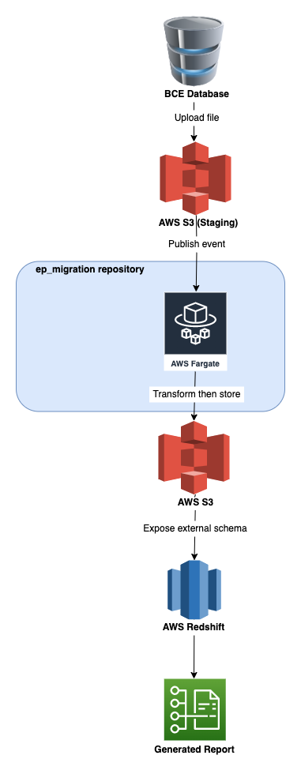

===========
load_bce_to_s3
===========

Related to tickets:
* DE-1111 https://jira.visable.com/browse/DE-1111
* DE-1036 https://jira.visable.com/browse/DE-1036

User Web interaction data on the Europages website traced and collected by AT INTERNET is to be migrated into the Europages' datawarehouse.
There are currently 6 complementary data files per hour to be downloaded, which represent an average of 5 millions records to be loaded daily into a final datawarehouse table.

As of writing (May 2022) this process shall in the future utilise `Piano Analytics`, which is the logical progression `Analytics Suite 2` (API V2). Processing in Analytics Suite 2 is being stopped.
Some of the current features available will be automatically migrated, however some will not. From September 2022 no more new data will be integrated into the
`Analytics Suite 2` (API V2).

The purpose of this repository is to ease a seamless migration between these two processes. Since the API Endpoint will be deprecated, the process shall
instead rely on an upload to a dedicated Visable AWS S3 bucket/folder, whereby this shall in turn trigger a sequence of transform and load events, subsequently
leading to a generated report and corresponding populated tables in AWS Redshift. The following `Description` outlines a more detailed analysis of the processes required:

Description
===========

For an overview please also refer to the diagram below.

1. A query is first made to AT Internet, which specifies the data required. Every hour the AT Internet data are prepared.

2. These data in the form of `parquet` files are uploaded to a dedicated Visable AWS S3 `Staging` bucket and object. This is performed once daily.

3. The uploading of data to the AWS S3 bucket publishes an event of the type `s3:ObjectCreated:*` and gets sent to a dedicated AWS messaging queue.

4. An AWS Lambda polls the dedicated messaging queue and subsequently invokes the Lambda function.

    1. The Lambda function unpacks the `event` that contains the queue message(s). This message will have been encoded in Base64, therefore it requires decoding
    2. These messages are analysed and filtered to determine the file that was recently uploaded. The parquet file is first verified to determine whether the uploaded file really does refer to the previous day's data, via the file naming convention and RegEx filters.
    3. Upon verification, the file then undergoes a transformation that ultimately enables populating - further downstream - to AWS Redshift tables. Such transformation comprises
a conversion of the data types in the columns, replacement of 'nan' values with '0', the 'None' values in string typed columns are replaced with empty strings ('').

5. The transformed data are then uploaded to another folder within the same aforementioned AWS S3 bucket.

6. The transformed data are then exposed to an external table in AWS Redshift. From here, the BCE Database and AT Internet data are `joined` (NB: the SQL join clause) via unique identifiers in both of these data sources.

|EP Migration|

Tests
=====
In order to execute unittests in stand-alone:

`pipenv run nosetests --with-coverage --cover-min-percentage=50 --cover-package=src`

Links
=====
* AT Internet Data Flow https://developers.atinternet-solutions.com/category/data-api-en/data-flow-en/
* piano: what do I need to migrate https://support.piano.io/hc/en-us/articles/4466303556370-What-do-I-need-to-do-to-migrate-#DataFlow
* AWS Redshift https://aws.amazon.com/redshift/
* AWS SQS https://aws.amazon.com/sqs/
* AWS CloudFormation https://aws.amazon.com/cloudformation/
* AWS Lambda https://aws.amazon.com/lambda/